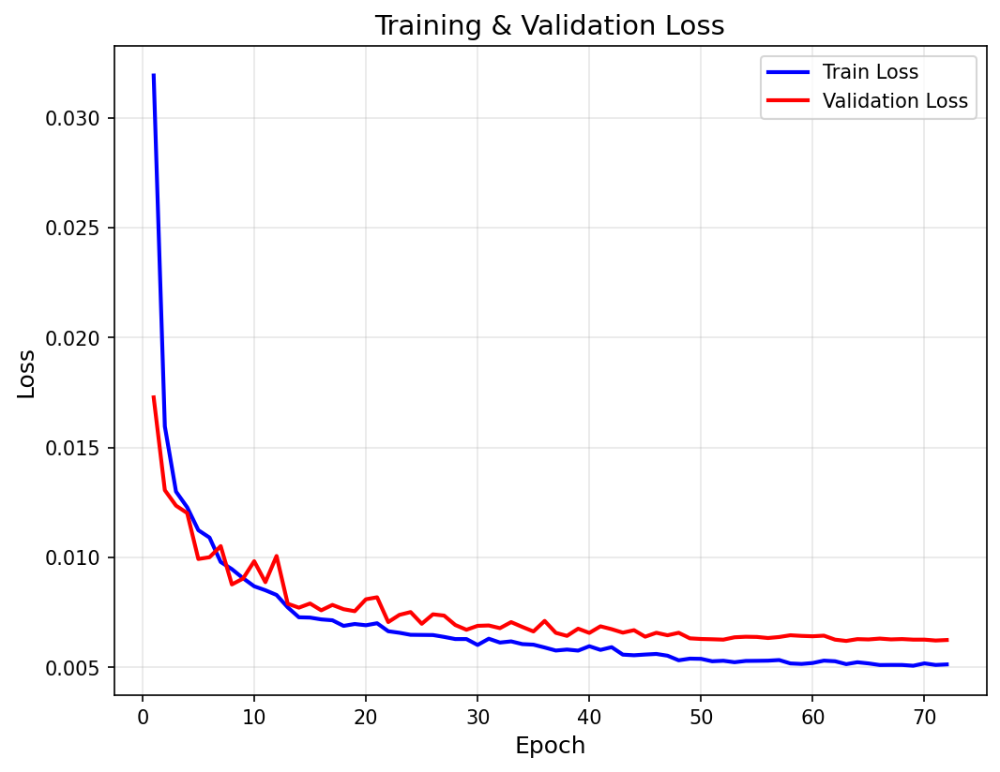
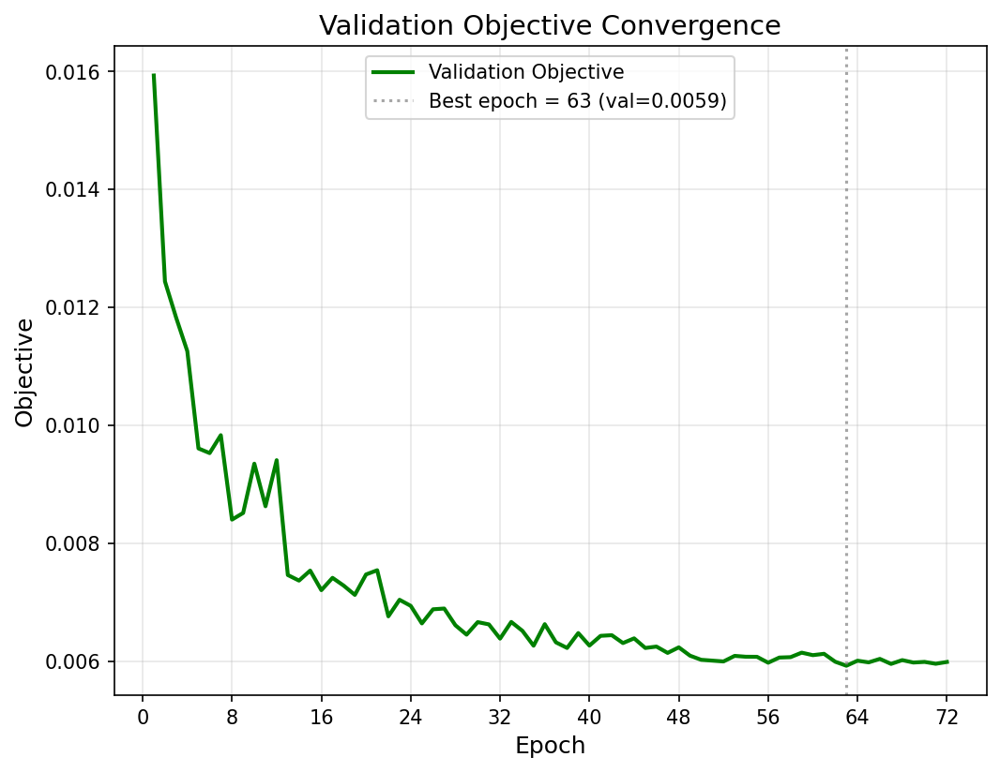

# Neural Algorithm Scorer

**A deep‑learning model to score Rubik’s cube algorithms, trained on human preference data.**
GitHub: [https://github.com/nbwzx/neural-algorithm-scorer](https://github.com/nbwzx/neural-algorithm-scorer)

---

## Abstract

We present a neural algorithm scorer for Rubik’s cube algorithms that predicts algorithm quality without explicit move‑count metrics. Trained end‑to‑end on a differentiable approximation of a crowdsourced ranking objective, the model assigns lower scores to better algorithms. Evaluated against a comprehensive set of baselines—standard move counts (STM, QTM), a weighted move count metric (WMC), and the [Movecount Coefficient](https://github.com/trangium/trangium.github.io/tree/master/MovecountCoefficient) (MCC, implemented as `algSpeed`)—our method substantially outperforms all, achieving significantly higher alignment with human‑rated solutions. The lightweight Transformer architecture (embedding dimension 64, 3 layers, 4 attention heads, feed‑forward hidden size 256) with RMSNorm, SwiGLU, Rotary Position Embeddings, and attention dropout ensures stable training and strong generalisation.

---

## 1. Introduction

In blindfolded cubing (BLD), there are 1008 different 3‑style corner cases. For each case, dozens of candidate algorithms exist, but top BLD solvers develop strong preferences that go beyond mere move count. For example, algorithms favouring faces like R, U, D, and F are generally faster and more comfortable than those involving B, L, or wide moves. These preferences reflect subtle ergonomic qualities—fingertrick ease, regrip avoidance, and overall flow—that are difficult to capture with hand‑crafted metrics.

Existing ranking approaches rely on static rules such as move length (STM, QTM), weighted sums of per‑move difficulties (Weighted Move Count), or the Movecount Coefficient (MCC). The MCC, introduced by Trangium, models finger burden, wrist turns, push moves, and regrips; our `algSpeed` implementation is the Python version of the original code. While more sophisticated than plain move counting, these rule‑based metrics are fixed and cannot adapt to human preferences or to subtle patterns that emerge from large‑scale human ratings.

Neural networks have been applied to solve the cube (e.g., DeepCubeA), but ranking algorithms for a given state has received less attention. We bridge this gap by learning a scoring function directly from user‑provided rankings.

---

## 2. Dataset and Preprocessing

### 2.1 Data Sources

We use two complementary data sources:

- **`cornerManmade.json`** – For each cube state, this file provides a list of candidate algorithms along with user vote counts. These votes reflect the collective preferences of experienced solvers.
- **`cornerRanking.json`** – For each state, this file supplies a list of 200 good algorithms, which we treat as a high‑quality reference set.

From these, we construct for each state $s$:

- $\mathcal{E}_s$ – the set of candidate algorithms drawn from `cornerManmade.json`.
- $\mathcal{R}_s$ – the reference set of $K = 200$ algorithms (from `cornerRanking.json`). In practice we sample or take the top entries to ensure $K$ is fixed across states.
- $r(a)$ – a user preference weight for algorithm $a \in \mathcal{E}_s$, derived by aggregating votes.

### 2.2 Preprocessing

Algorithms are tokenised into atomic moves (e.g., `R`, `U'`, `F2`). A tokeniser is built from all unique moves in the union of both datasets. Sequences are padded to a fixed length $L = 50$ to enable batched processing. All tokenisation is cached to disk to avoid recomputation across training epochs.

---

## 3. Training Objective

With the dataset constructs ($\mathcal{E}\_s$, $\mathcal{R}\_s$, $r$($a$)) defined above, we now formalise the learning task.

### 3.1 Problem Statement

We learn a scoring function $f_\theta: \mathcal{A} \to \mathbb{R}$ (where $\mathcal{A}$ is the space of all Rubik's cube algorithms) such that lower scores indicate better algorithms. Ideally, for any state $s$ and any two algorithms $a, b \in \mathcal{E}\_s$, if $r(a) > r(b)$ then $f\_\theta(a) < f\_\theta(b)$.

### 3.2 Exact Quality Objective

For a given state $s$, the exact objective we wish to minimise is the expected misranking penalty:

$$
O_s = \sum_{a \in \mathcal{E}_s} r(a) \cdot \frac{1}{K} \sum_{b \in \mathcal{R}_s} \mathbf{1}\bigl[f_\theta(a) < f_\theta(b)\bigr],
$$

where $\mathbf{1}[\cdot]$ is the indicator function. This objective penalises algorithms that are highly preferred by users (large $r$($a$)) but are scored worse than many reference algorithms.

### 3.3 Differentiable Approximation

To enable end‑to‑end training, we replace the non‑differentiable indicator with a sigmoid:

$$
\tilde{O}_s = \sum_{a \in \mathcal{E}_s} r(a) \cdot \frac{1}{K} \sum_{b \in \mathcal{R}_s} \sigma\ \left( \frac{f_\theta(b) - f_\theta(a)}{\tau} \right),
$$

with temperature $\tau = 0.1$ (`TEMPERATURE = 0.1`). As $\tau \to 0$, $\tilde{O}_s$ approaches the exact objective $O_s$.

### 3.4 Loss Function

The training loss is the average of $\tilde{O}_s$ over a batch of states:

$$
\mathcal{L} = \frac{1}{B} \sum_{s \in \text{batch}} \tilde{O}_s.
$$

Minimising $\mathcal{L}$ drives the model to assign lower scores to more preferred algorithms, aligning with the human‑derived ranking.

---

## 4. Model Architecture

We use a lightweight Transformer encoder (`AlgorithmScorer`) with the following hyperparameters (all configurable at the top of `main.py`):

- **Token Embedding**: `vocab_size × 64` (embedding dimension `DIM = 64`).
- **Rotary Position Embeddings (RoPE)** – encodes relative positions for better sequence extrapolation.
- **3 layers** (`NUM_LAYERS = 3`) with:
  - Multi‑head self‑attention with 4 heads (`NUM_HEADS = 4`, head dimension 16) with causal masking and dropout 0.1.
  - RMSNorm before each sub‑layer.
  - SwiGLU activation in the feed‑forward network (inner dimension 256, `FF_HIDDEN_DIM = 256`).
  - Residual dropout 0.1.
- **Pooling**: mean over the sequence, followed by a linear projection to a scalar score.

The total number of parameters is approximately 0.2 million, allowing fast inference on CPU and GPU.

---

## 5. Training and Results

### 5.1 Training Optimisation

States are split into training, validation, and test sets (75%/15%/10%) using a fixed random seed (`SEED = 42`) to ensure reproducibility. The tokeniser is built from the union of all algorithms, and token caching persists across epochs (and is saved in checkpoints) to avoid recomputation.

We use AdamW with learning rate $1\times10^{-3}$ (`LR = 1e-3`) and weight decay $0.01$ (`WEIGHT_DECAY = 0.01`, applied to all parameters except biases and layer‑norm weights). Gradients are clipped to norm 1.0. A batch consists of 16 states (`BATCH_SIZE = 16`); all candidate and reference algorithms are concatenated and processed in a single forward pass (dynamic batching) to reduce overhead.

We apply **ReduceLROnPlateau** (factor 0.5, patience 3) on the validation objective, and stop early if no improvement occurs for 10 epochs (`PATIENCE = 10`, max 100 epochs). The full training state is checkpointed after every epoch (auto‑resume from `checkpoint.pt`), with the best model saved as `best_model.pth`. During evaluation, memory‑aware batching (chunk size 64) is used to avoid OOM when scoring many algorithms.

### 5.2 Training Dynamics



The training loss drops from 0.031924 to 0.005136 over the course of training, while the validation loss follows a similar downward path with only modest fluctuations—suggesting stable convergence without overfitting. Plateaus in the validation loss trigger automatic learning rate reductions, which help the optimizer escape flat regions and continue making progress, as reflected in the sustained decline of both curves.



The validation objective, our primary metric, improves steadily from an initial value of 0.015929 to a best of 0.005921.

### 5.3 Quantitative Results

Our neural algorithm scorer consistently outperforms all baselines on the held-out test set. The numbers below are from a representative run using the default configuration.

| Method                          | Test Objective |
|---------------------------------|----------------|
| STM (slice turn metric)         | 0.132985       |
| QTM (quarter turn metric)       | 0.085444       |
| WMC (weighted move count)       | 0.031352       |
| MCC (movecount coefficient)     | 0.025986       |
| **Our model (Neural Algorithm Scorer)**   | **0.005813**   |

Smaller values are better. Our model captures non‑length‑based quality signals and generalises well, as evidenced by the larger gap on the validation set.

---

## 6. Usage Instructions

### Training
```bash
python main.py
```
Loads data, builds the tokenizer, trains the model, and logs progress to a timestamped run folder (e.g., `20260101_120000/`). All hyperparameters are defined at the top of `main.py` and can be adjusted.

### Inference with `export.py`
Example commands:

- Sort a simple ranking JSON (state → list of algs)
  `python export.py ranking.json output.json [--top-k 18]`

- Sort cornerManmade.json (nested entries) by model score
  `python export.py cornerManmade.json cornerManmadeSorted.json`

- Sort a plain text file (one alg per line)
  `python export.py algs.txt algs_sorted.txt --txt [--with-scores] [--top-k 100]`

- Sort all .txt files in a directory
  `python export.py --dir data/ [--output-dir sorted/] [--top-k 100]`
  
By default loads the best model from `best/`; override with `--run-dir` to point to a specific training run folder.

### Generating a Sorted Ranking

The original `cornerRanking.json` contains unsorted algorithms per state. Our `export.py` sorts them by model score (best first, i.e. lowest score = highest quality) and outputs a fully sorted version `cornerRankingSorted.json`, ready for manual reference.

Usage:

```bash
python export.py cornerRanking.json cornerRankingSorted.json
```

---

## 7. Conclusion

We have presented a neural algorithm scorer that focuses on Rubik’s cube 3‑style corner algorithms, significantly outperforming move‑count and ergonomic metrics by learning directly from human preferences. While our evaluation centres on 3-style corner cases, the approach is general and can be applied to other domains within cubing—including parity algorithms, 3‑style edges, or speedsolving substeps like ZBLL—provided similar preference data is available.

---

## 8. License

GPLv3 License – see [LICENSE](LICENSE).

    Copyright (C) 2026 Zixing Wang

    This program is free software: you can redistribute it and/or modify
    it under the terms of the GNU General Public License as published by
    the Free Software Foundation, either version 3 of the License, or
    (at your option) any later version.

    This program is distributed in the hope that it will be useful,
    but WITHOUT ANY WARRANTY; without even the implied warranty of
    MERCHANTABILITY or FITNESS FOR A PARTICULAR PURPOSE.  See the
    GNU General Public License for more details.

    You should have received a copy of the GNU General Public License
    along with this program.  If not, see <http://www.gnu.org/licenses/>.